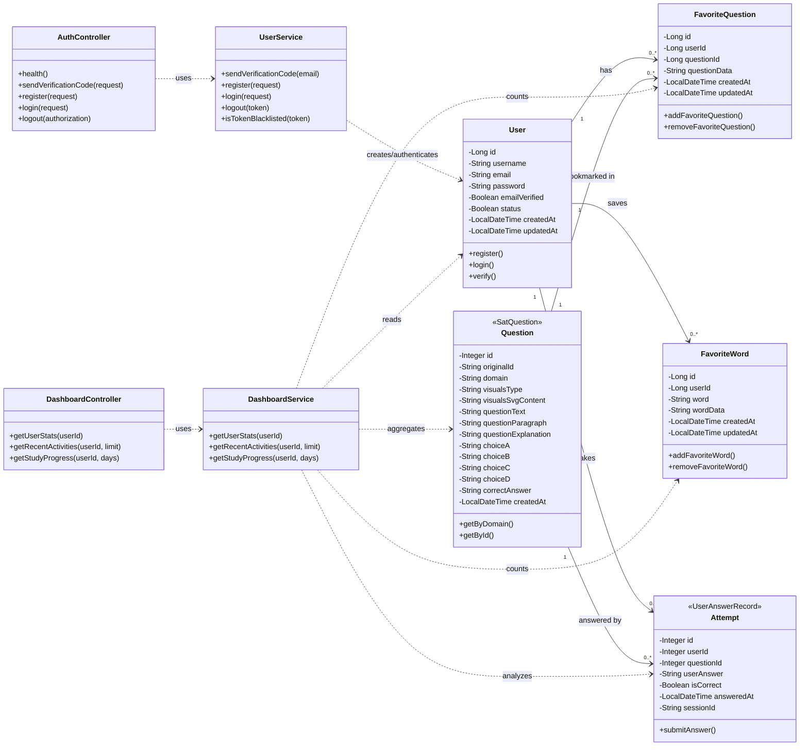

# SAT Backend UML Class Diagram

This diagram extends your current `User` and `Question` sketch with:

- `FavoriteQuestion`
- `FavoriteWord`
- `Attempt` (`UserAnswerRecord` in code)
- `AuthController`
- `DashboardController`
- the relationships between the domain classes and controller/service layer

## Notes

- `Question` in the diagram maps to the backend class `SatQuestion`.
- `Attempt` in the diagram maps to the backend class `UserAnswerRecord`.
- `AuthController` does not directly own entities; it depends on `UserService`, which manages `User` authentication and session flow.
- `DashboardController` depends on `DashboardService`, which reads `Attempt`, `FavoriteQuestion`, `FavoriteWord`, `Question`, and `User` data to build dashboard statistics.
