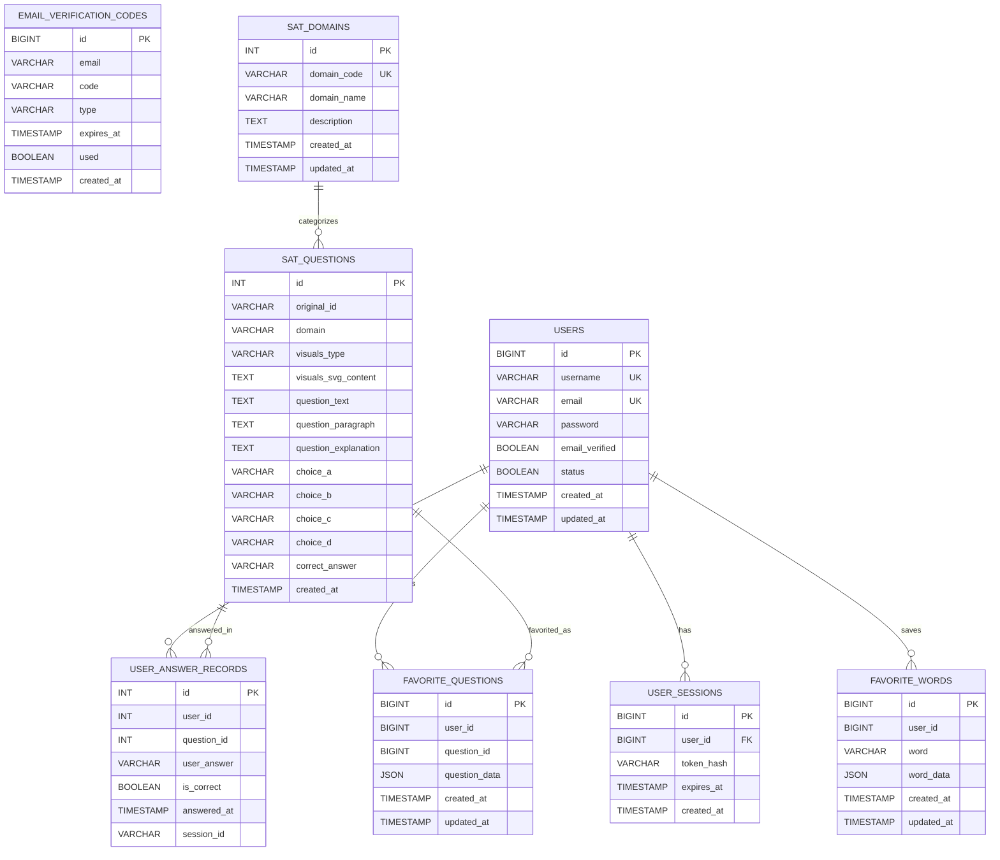

# 用户认证系统

这是一个完整的用户注册和登录系统，包含邮箱验证功能。

## 功能特性

- ✅ 用户注册（需要邮箱验证）
- ✅ 用户登录
- ✅ 邮箱验证码发送
- ✅ JWT Token认证
- ✅ 密码加密存储
- ✅ 响应式前端界面
- ✅ 现代化主页设计
- ✅ 路由导航系统

## 技术栈

### 后端 (Spring Boot)
- Spring Boot 3.3.1
- MyBatis Plus
- MySQL 8.0
- JWT Token
- Spring Mail (邮箱验证)
- BCrypt 密码加密

### 前端 (React)
- React 19.1.1
- TypeScript
- React Router (路由管理)
- Axios (HTTP客户端)
- CSS3 (响应式设计)

## 数据库表结构

### 数据库 ERD



### ERD 说明

- `users -> user_sessions` 是当前脚本里真正定义了外键的关系。
- `users -> user_answer_records`、`users -> favorite_questions`、`users -> favorite_words` 是明确的逻辑关系，字段分别通过 `user_id` 关联。
- `sat_questions -> user_answer_records` 和 `sat_questions -> favorite_questions` 也是明确的逻辑关系，字段通过 `question_id` 关联。
- `sat_domains -> sat_questions` 在当前脚本里是可选外键关系，因为 `sat_questions.domain` 对应 `sat_domains.domain_code` 的外键语句被注释掉了。
- `email_verification_codes` 只通过 `email` 与 `users.email` 形成业务关联，没有定义外键，所以在 ERD 里不画强实体关系。

### 1. 用户表 (users)
```sql
CREATE TABLE IF NOT EXISTS `users` (
  `id` bigint NOT NULL AUTO_INCREMENT COMMENT '用户ID',
  `username` varchar(50) NOT NULL COMMENT '用户名',
  `email` varchar(100) NOT NULL COMMENT '邮箱',
  `password` varchar(255) NOT NULL COMMENT '密码(加密)',
  `email_verified` tinyint(1) NOT NULL DEFAULT '0' COMMENT '邮箱是否已验证',
  `status` tinyint(1) NOT NULL DEFAULT '1' COMMENT '用户状态: 1-正常, 0-禁用',
  `created_at` timestamp NOT NULL DEFAULT CURRENT_TIMESTAMP COMMENT '创建时间',
  `updated_at` timestamp NOT NULL DEFAULT CURRENT_TIMESTAMP ON UPDATE CURRENT_TIMESTAMP COMMENT '更新时间',
  PRIMARY KEY (`id`),
  UNIQUE KEY `uk_username` (`username`),
  UNIQUE KEY `uk_email` (`email`)
);
```

### 2. 邮箱验证码表 (email_verification_codes)
```sql
CREATE TABLE IF NOT EXISTS `email_verification_codes` (
  `id` bigint NOT NULL AUTO_INCREMENT COMMENT '验证码ID',
  `email` varchar(100) NOT NULL COMMENT '邮箱',
  `code` varchar(10) NOT NULL COMMENT '验证码',
  `type` varchar(20) NOT NULL DEFAULT 'REGISTER' COMMENT '验证码类型: REGISTER-注册, RESET-重置密码',
  `expires_at` timestamp NOT NULL COMMENT '过期时间',
  `used` tinyint(1) NOT NULL DEFAULT '0' COMMENT '是否已使用',
  `created_at` timestamp NOT NULL DEFAULT CURRENT_TIMESTAMP COMMENT '创建时间',
  PRIMARY KEY (`id`)
);
```

### 3. 用户会话表 (user_sessions)
```sql
CREATE TABLE IF NOT EXISTS `user_sessions` (
  `id` bigint NOT NULL AUTO_INCREMENT COMMENT '会话ID',
  `user_id` bigint NOT NULL COMMENT '用户ID',
  `token_hash` varchar(255) NOT NULL COMMENT 'Token哈希值',
  `expires_at` timestamp NOT NULL COMMENT '过期时间',
  `created_at` timestamp NOT NULL DEFAULT CURRENT_TIMESTAMP COMMENT '创建时间',
  PRIMARY KEY (`id`),
  FOREIGN KEY (`user_id`) REFERENCES `users` (`id`) ON DELETE CASCADE
);
```

### 4. 收藏题目表 (favorite_questions)
```sql
CREATE TABLE IF NOT EXISTS favorite_questions (
  id BIGINT PRIMARY KEY AUTO_INCREMENT,
  user_id BIGINT NOT NULL,
  question_id BIGINT NOT NULL,
  question_data JSON NOT NULL COMMENT '存储完整的题目数据',
  created_at TIMESTAMP DEFAULT CURRENT_TIMESTAMP,
  updated_at TIMESTAMP DEFAULT CURRENT_TIMESTAMP ON UPDATE CURRENT_TIMESTAMP,
  UNIQUE KEY uk_user_question (user_id, question_id),
  INDEX idx_user_id (user_id),
  INDEX idx_question_id (question_id),
  INDEX idx_created_at (created_at)
);
```

### 5. 收藏单词表 (favorite_words)
```sql
CREATE TABLE IF NOT EXISTS favorite_words (
  id BIGINT PRIMARY KEY AUTO_INCREMENT,
  user_id BIGINT NOT NULL,
  word VARCHAR(255) NOT NULL,
  word_data JSON NOT NULL COMMENT '存储完整的单词数据',
  created_at TIMESTAMP DEFAULT CURRENT_TIMESTAMP,
  updated_at TIMESTAMP DEFAULT CURRENT_TIMESTAMP ON UPDATE CURRENT_TIMESTAMP,
  UNIQUE KEY uk_user_word (user_id, word),
  INDEX idx_user_id (user_id),
  INDEX idx_created_at (created_at)
);
```

### 6. 用户答题记录表 (user_answer_records)
```sql
CREATE TABLE IF NOT EXISTS user_answer_records (
  id INT AUTO_INCREMENT PRIMARY KEY COMMENT '自增ID',
  user_id INT COMMENT '用户ID（暂时可以为空，后续集成用户系统）',
  question_id INT NOT NULL COMMENT '题目ID',
  user_answer VARCHAR(10) COMMENT '用户答案 (A, B, C, D)',
  is_correct BOOLEAN COMMENT '是否正确',
  answered_at TIMESTAMP DEFAULT CURRENT_TIMESTAMP COMMENT '答题时间',
  session_id VARCHAR(100) COMMENT '会话ID（用于临时用户）',
  INDEX idx_user_question (user_id, question_id),
  INDEX idx_session_question (session_id, question_id),
  INDEX idx_question (question_id),
  INDEX idx_answered_at (answered_at)
);
```

### 7. SAT 领域表 (sat_domains)
```sql
CREATE TABLE IF NOT EXISTS sat_domains (
  id INT AUTO_INCREMENT PRIMARY KEY COMMENT '自增ID',
  domain_code VARCHAR(50) NOT NULL UNIQUE COMMENT '领域代码',
  domain_name VARCHAR(100) NOT NULL COMMENT '领域名称',
  description TEXT COMMENT '领域描述',
  created_at TIMESTAMP DEFAULT CURRENT_TIMESTAMP COMMENT '创建时间',
  updated_at TIMESTAMP DEFAULT CURRENT_TIMESTAMP ON UPDATE CURRENT_TIMESTAMP COMMENT '更新时间'
);
```

### 8. SAT 题目表 (sat_questions)

`sat_questions` 的结构由当前后端实体 `SatQuestion` 使用，项目脚本里目前只包含补充字段与索引的迁移脚本，例如 `Java/database/add_correct_answer_column.sql`。它在 ERD 中与 `user_answer_records`、`favorite_questions`、`sat_domains` 形成关系。

## 快速开始

### 1. 数据库设置
1. 创建MySQL数据库 `sale`
2. 执行 `Java/database/create_user_auth_tables.sql` 创建表结构

### 2. 后端配置
1. 修改 `Java/src/main/resources/application.yml` 中的数据库连接信息
2. 修改邮箱配置（SMTP设置）
3. 启动Spring Boot应用：
```bash
cd Java
mvn spring-boot:run
```

### 3. 前端启动
```bash
cd SATProject
npm install
npm run dev
```

## 路由结构

### 前端路由
- `/` - 主页（欢迎页面，包含登录/注册按钮）
- `/auth` - 认证页面
  - `/auth?mode=login` - 登录表单
  - `/auth?mode=register` - 注册表单
- `/*` - 其他路径重定向到主页

### 页面功能
1. **主页** (`/`) - 展示项目介绍和功能特性，提供登录/注册入口
2. **认证页面** (`/auth`) - 根据URL参数显示登录或注册表单
3. **导航栏** - 固定顶部导航，包含Logo和登录/注册按钮

## API接口

### 1. 发送验证码
- **POST** `/api/auth/send-verification-code`
- **请求体**: `{ "email": "user@example.com" }`
- **响应**: `{ "code": 200, "message": "验证码发送成功" }`

### 2. 用户注册
- **POST** `/api/auth/register`
- **请求体**: 
```json
{
  "username": "testuser",
  "email": "user@example.com",
  "password": "password123",
  "verificationCode": "123456"
}
```
- **响应**: 
```json
{
  "code": 200,
  "message": "注册成功",
  "data": {
    "token": "jwt_token_here",
    "refreshToken": "refresh_token_here",
    "userId": 1,
    "username": "testuser",
    "email": "user@example.com",
    "emailVerified": true
  }
}
```

### 3. 用户登录
- **POST** `/api/auth/login`
- **请求体**: 
```json
{
  "usernameOrEmail": "testuser",
  "password": "password123"
}
```
- **响应**: 同注册接口

### 4. 用户登出
- **POST** `/api/auth/logout`
- **请求头**: `Authorization: Bearer <token>`
- **响应**: `{ "code": 200, "message": "登出成功" }`

## 安全特性

1. **密码加密**: 使用BCrypt加密存储密码
2. **JWT Token**: 使用JWT进行身份认证
3. **邮箱验证**: 注册时必须验证邮箱
4. **验证码过期**: 验证码10分钟过期
5. **Token黑名单**: 登出时Token加入黑名单
6. **输入验证**: 前后端都有输入验证

## 注意事项

1. 确保MySQL服务正在运行
2. 确保邮箱SMTP配置正确
3. 前端默认连接 `http://localhost:8080` 后端API
4. 验证码有效期10分钟，请及时使用
5. JWT Token有效期24小时，Refresh Token有效期7天

## 文件结构

```
SAT Project/
├── Java/                          # Spring Boot后端
│   ├── database/                  # 数据库脚本
│   │   └── create_user_auth_tables.sql
│   └── src/main/java/com/sts/sale/
│       ├── controller/             # 控制器
│       │   └── AuthController.java
│       ├── dto/                    # 数据传输对象
│       │   ├── ApiResponse.java
│       │   ├── AuthResponse.java
│       │   ├── LoginRequest.java
│       │   ├── RegisterRequest.java
│       │   └── SendVerificationCodeRequest.java
│       ├── mapper/                 # 数据访问层
│       │   ├── EmailVerificationCodeMapper.java
│       │   ├── UserMapper.java
│       │   └── UserSessionMapper.java
│       ├── model/                  # 实体类
│       │   ├── EmailVerificationCode.java
│       │   ├── User.java
│       │   └── UserSession.java
│       ├── service/                # 业务逻辑层
│       │   ├── EmailService.java
│       │   └── UserService.java
│       └── utils/                  # 工具类
│           ├── JwtUtil.java
│           └── PasswordUtil.java
└── SATProject/                     # React前端
    └── src/
        ├── components/             # React组件
        │   ├── LoginForm.tsx
        │   └── RegisterForm.tsx
        ├── pages/                  # 页面
        │   └── AuthPage.tsx
        ├── services/               # API服务
        │   └── authService.ts
        └── types/                  # TypeScript类型
            └── auth.ts
```
